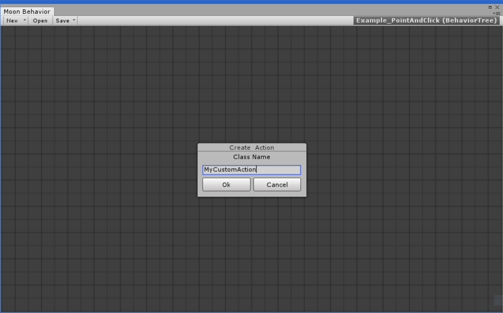

Custom Tasks allows you to put custom actions and logic , interacting with your game code and much more.

# Creating a custom action

1- On en empty point on graph right click and over 'Create'


then select the type of node that you want to create.

2- Set the name and select the type, then hit 'Create'



3- Then your script editor should open the file

>**The files are default saved to:** Assets/MoonBehavior/Actions/BehaviorTrees

##Actions 

Custom actions are functionality that the AI executes. ( eg: Move , Destroying , Animating..)

the default layout for a custom action are:

```csharp
using System.Collections;
using System.Collections.Generic;
using UnityEngine;
using MoonBehavior.BehaviorTrees;

public class MyCustomAction : Task
{
    public override TaskResult OnExecute(MoonAI ai)
    {

        return TaskResult.Success;
    }
}

```

You must return an state (FAILURE , SUCCESS , RUNNING ) depending on what you are doing..

> The custom Action Class must derived from **Task**. 

##Decisions

Decisions are actions that executes other actions as childs.

the default layout for decision are the similar as Actions but it has the **Childs** Property:

```csharp

using System.Collections;
using System.Collections.Generic;
using UnityEngine;
using MoonBehavior.BehaviorTrees;

public class MyCustomDecision : Decision
{
    // Called when the task is executed
    public override TaskResult OnExecute(MoonAI ai)
    {

        for (int i = 0; i < Childs.Length; i++)
        {
            TaskResult result = Childs[i].Execute(ai);
            if (result == TaskResult.Failure)
                return result;
        }

        return TaskResult.Success;
    }
}

```
> The custom Decision class must derived from **Decision**. 

####SingleChildAttribute
Attribute used for limiting a decision to have only 1 child.

```csharp
using System.Collections;
using System.Collections.Generic;
using UnityEngine;
using MoonBehavior.BehaviorTrees;

[SingleChild]
public class MyCustomDecision : Decision
{
    // Called when the task is executed
    public override TaskResult OnExecute(MoonAI ai)
    {

        if (Childs.Length > 0)
            return Childs[0].Execute(ai);

        return TaskResult.Success;
    }
}
```

## Adding extra info to your actions

You can add extra information to your action trought InfoAttribute.<br> 
You can override propertys:<br>
**Name** Display node name<br>
**Category** Node category <br>
**Description** Node description in the inspector