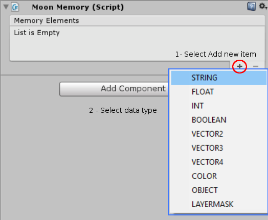

AI memory allows you to store some information between the BehaviorTree and the AI agent

The AI memory stores every element as object type that means that you can store on the memory almost every data type (via script).

### Adding elements



** C# API: **

```csharp
using System.Collections;
using System.Collections.Generic;
using UnityEngine;
using MoonBehavior.BehaviorTrees;

public class ExampleScript : MonoBehaviour
{
    public MoonAI ai;
    private void Start()
    {
        ai.Memory.SetValue("PlayerHealth", 100.0f);
        ai.Memory.SetValue("PlayerLives", 3);
    }
}
```

### Removing elements
To remove elements in the inspector it's just clicking on the (-) buttun and it will remove the selected item.


** C# API: **
 
```csharp
using System.Collections;
using System.Collections.Generic;
using UnityEngine;
using MoonBehavior.BehaviorTrees;

public class ExampleScript : MonoBehaviour
{
    public MoonAI ai;
    private void Start()
    {
        ai.Memory.RemoveValue("PlayerHealth");
    }
}
```
### Get values

** C# API: **

```csharp
using System.Collections;
using System.Collections.Generic;
using UnityEngine;
using MoonBehavior.BehaviorTrees;

public class ExampleScript : MonoBehaviour
{
    public MoonAI ai;
    private void Start()
    {
        float Power = ai.Memory.GetValue<float>("ShootPower");
    }
}
```

Get values with MemoryItem:

Allows support of constant and memory-based values (memory keys) of different data types inside unity's inspector.  That enables getting values without need to manually check if the value is a constant or memory value.

> NOTE: it actually doesn't support array.

```csharp

using System.Collections;
using System.Collections.Generic;
using UnityEngine;
using MoonBehavior.BehaviorTrees;
using MoonBehavior.Memory;

public class ExampleScript : MonoBehaviour
{
    public MoonAI ai;
    public MemoryItem Attack = new MemoryItem(ItemType.FLOAT);
    private void Start()
    {
        float attack = Attack.GetValue<float>(ai.Memory);
    }
}

```

### Clear Memory

To clear the memory Simply call The **Clear()** Method

> It will kill all the AI memory, so be careful about destroying the memory data.

```csharp

using System.Collections;
using System.Collections.Generic;
using UnityEngine;
using MoonBehavior.BehaviorTrees;
using MoonBehavior.Memory;

public class ExampleScript : MonoBehaviour
{
    public MoonAI ai;
    private void Start()
    {
        ai.Memory.Clear();
    }
}

```

### Save & Load

Saving and loading data allows you to keep in HDD / RAM the AI's Memory.

It will return an byte array and you can save it later to a file and loaing it again.

> **Note:** the serialization and des-serialization can be **slow** because it encrypts and decrypts the information to return safe data.

> Doesn't support UnityObject-derived (UnityEngine.Object) data types because it's not safe at serialization

**Saving**

To save from memory call : Save()

Example saving data:

```csharp
using System.Collections;
using System.Collections.Generic;
using System.IO;
using UnityEngine;
using MoonBehavior.BehaviorTrees;

public class ExampleScript : MonoBehaviour
{
    public MoonAI ai;
    private void Start()
    {
        // Push some data to the memory
        for (int i = 0; i < 100; i++)
        {
            ai.Memory.SetValue(i.ToString(), i + (Random.value * i));
        }

        // Save the memory data to ram
        byte[] SavedData = ai.Memory.Save();

        // save the memory to disc
        File.WriteAllBytes(Application.dataPath + "/Memory.txt", SavedData);
    }
}
```

**Loading**

To load from memory call : Load(byte[] Data , bool clear = false)
>Data: byte array of the previusly saved data.

>clear: Should clear memory before load ?

Example loading data:

```csharp
using UnityEngine;
using MoonBehavior.BehaviorTrees;

public class ExampleScript : MonoBehaviour
{
    public MoonAI ai;
    public TextAsset txt;

    private void Start()
    {
        ai.Memory.Load(txt.bytes);
    }
}
```